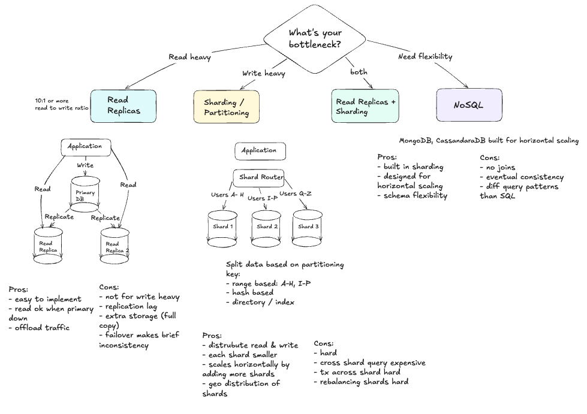
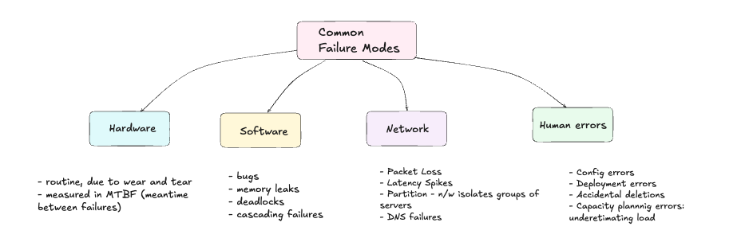
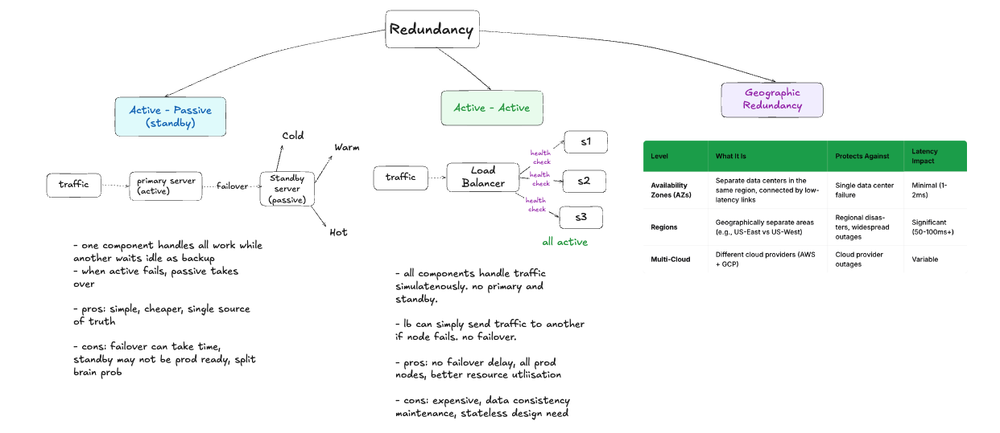
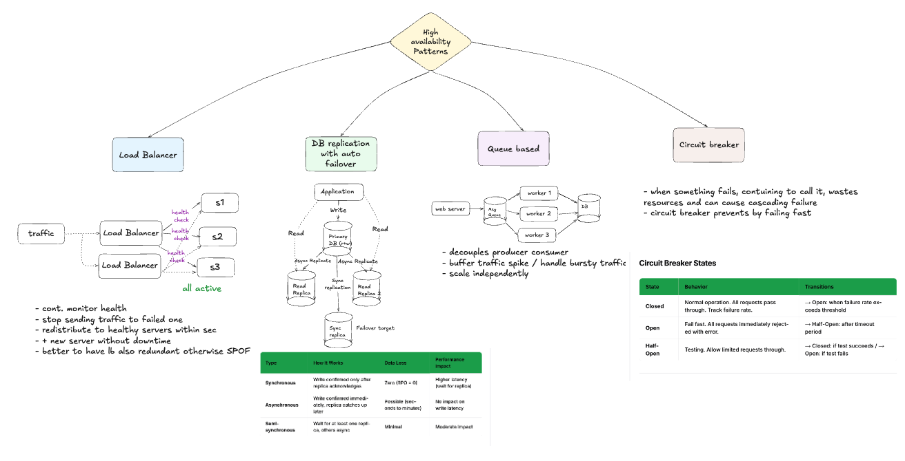

# Scalability

The ability of a system to handle inreased load by adding resources.

Always identify the bottleneck first before deciding how to scale.

Common patterns like load balancing, caching, async processing, and database optimization appear in almost every scalable system.

- **Vertical Scaling (Scale Up)**: adding more power to existing machines, like CPU cores, RAM, faster SSDs, increase bandwidth
    - Pros: simple, no architecure change, lower latency since everything local; no hops, no distributed complexity
    - Cons: hardware limits, SPF, cost, downtime during upgrades

- **Horizontal Scaling (Scale Out)**: adding more machines, distribute the load
    - Pros: exactly reverse of vertical cons
    - Cons: exact opposite, data consistency, stateless requirement

### Stateless vs Stateful services

- In the *stateful* model, once a user's session is stored on Server 1, all their requests must go to that same server. => SPF
- In the *stateless* model, session data lives in a shared store like Redis, so any server can handle any request. The load balancer has complete freedom to distribute traffic.

How to make service stateless?

1. Store session data in a shared cache 
2. Use JWT isntead of service side sessions
3. Store files in object storage instead of local disk

## Scaling Components 

### Application Tier

Easiest, key strategies: 

- Make services stateless
- Use load balancer
- Auto-scale
- Deploy across multiple ADs, regions

### Database Tier

Generally the hardest bcz gotta maintain ACID, cant simply put a load balancer in front of more DBs.

### Caching Tier

Strategies:
- Redis Cluster: automatic partitioning using hash slots
- Consistent Hashing: distibutes keys evenly and minimizes when redistribution when nodes are added or removed
- Cache-aside pattern: data checked in cache, not found (cache miss), go to DB, store in cache

### Message Queue Tier

- Async Workfloads
- Buffer traffic spikes so consumers can process at their own pace
- Decouple produces and consumers

[**Example Scaling**](https://algomaster.io/learn/system-design/scalability#example-scaling-from-0-to-millions-of-users)

----

# Availability

Measures how often your system is operational and accessible to users.

> Availability is not the same as reliability. A system can be highly available (always up) but unreliable (sometimes gives wrong answers).

## Measuring Availability

- **Availability = Uptime / (Uptime + Downtime)**
- Measured in nines - more nines, more availability

## Availability in Series vs Parallel

- **Series**: Availability multiplies. 99.99% App * 99.9% Web * 99.9% DB = *99.7%*
- **Parallel**: Power of redundancy. Assume 9.9% for both server 1 and 2
    - Failure probability = 0.1% * 0.1% = 0.001 * 0.001 = 0.000001 = **0.0001%**
    - Availability = 100% - 0.0001%  = 99.9999%

## Common Failure Modes

## Redundancy: Foundation of Availability

## High Availability Patterns

